---

---

源码 https://github.com/iMyGirl/C_Selfstudy

资料下载（提取码：htqp）：https://pan.baidu.com/s/11wJQAepvA2NjzRAQmKqr8g 

视频 <https://www.bilibili.com/video/BV1os411h77o>

# 我对自学的一些看法

- 为什么是A
- 什么是A
- 怎么用A
- 注意的问题
- A应用的领域
- A是否重要/对于初学者是否需要花很大力气研究A

谭浩强/林锐/王爽

# 我为什么要出视频

大环境、勤奋、出身、机遇、天赋

# 一、C 概述 —— 本讲内容概述

## 1. 为什么要学习 C 语言

>HellowWorld.c

```c
# include <stdio.h>
int main(void)
{
        printf("欢迎大家学习C语言\n");
        return 0;
}
```

### <1> C 的起源和发展


### <2> C 的特点

- 优点
  - 代码量小
  -  速度快
  - 功能强大
- 缺点
  - 危险性高
  - 开发周期长
  - 可移植性不强

### <3> C 的应用领域

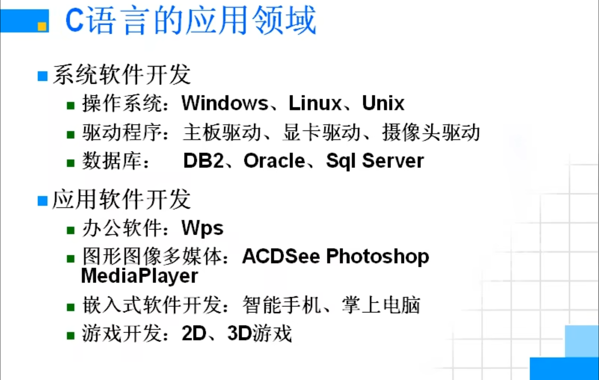

### <4> C 的 重要性

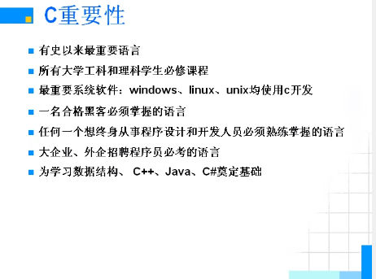

`龌龊的程序`

```c
/* 
    龌龊的程序！
*/

# include <stdio.h>
# include <windows.h>
# include <malloc.h>

int main(void)
{
    int c;
    int i;
    int j;
    
    nihao:
            printf("1: 死机\n");
            printf("2: 机房爆炸\n");
            printf("请选择:  ");
            
            scanf ("%d", &c);
            
            if (c ==1)
            {
                system("shutdown -s -t 60")
            }
            else if (2 == c)
            {
                printf("你太坏了 我要惩罚你！\n")
                for (j=0; j<10; ++j)
                    system("start");
            }
            else
            {
                printf("你敲错了，请重新输入！\n");
                goto nihao;
            }
    return 0;
}
```


`占满内存的程序` （内存泄漏）

```c
# include <stdio.h>
# include <malloc.h>

int main(void)
{
  while(1)
    {
      int *p = (int *)malloc(1000);
    }
  return 0;
}
```

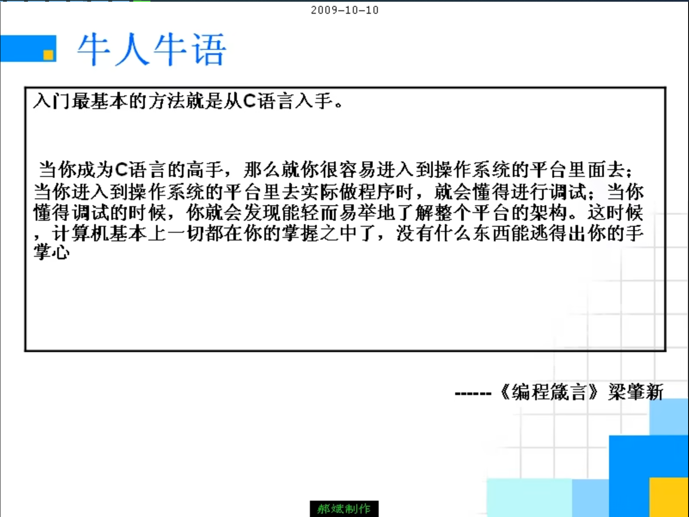

## 2. 怎样学习C语言

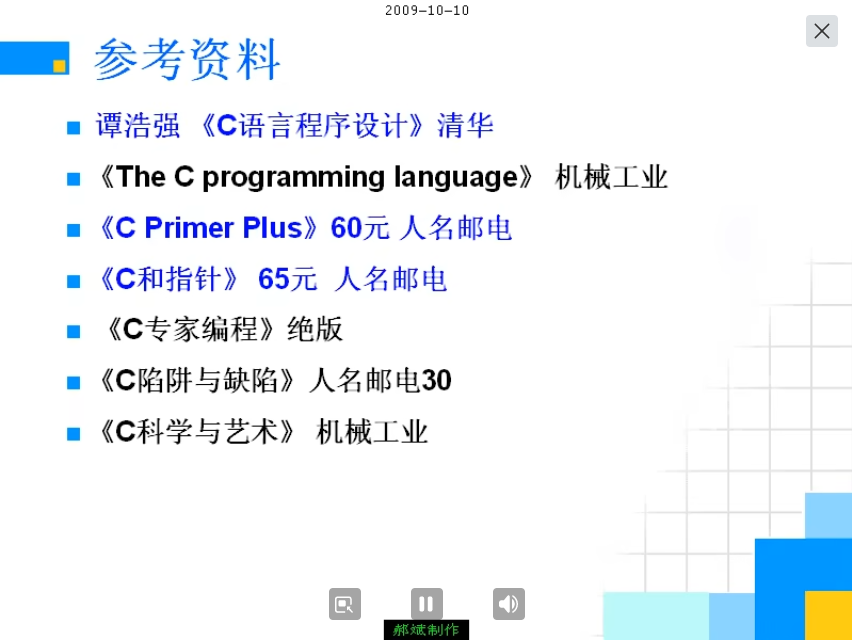


## 3. 学习的目标

- 了解程序语言及发展历史
- 熟练掌握C语言的语法规则
- 掌握简单的算法
- 理解面向过程的思想，这非常有助于将来对面向对象思想的学习
    - 能看懂程序
    - 会调试程序
    - 掌握将大问题转化为一系列小问题来求解的思想
- 为 C++ 、数据结构、C#、Java 打下良好的基础


## 4. 常见问题答疑
   1. 学习 java 为什么建议先学 C 语言

      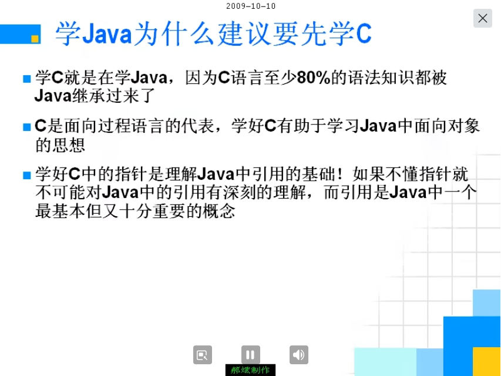

   2. 如果没有学过计算机专业课程能够学懂C语言吗

   3. 英语和数学不好能学好C吗

      

## 5. 课程计划

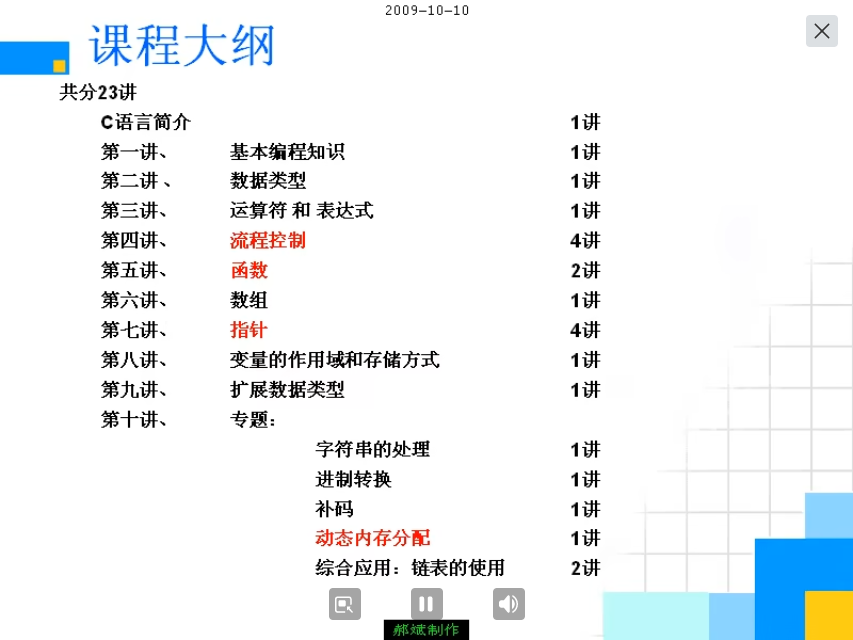

## 6. 举例子：一元二次方程


`computer.c`
```c
# include <stdio.h>
# include <math.h>

int main(void)
{
    // 把三个系数保存到计算机中
    int a = 1;  // =不表示相等，表示赋值
    int b = 5;
    int c = 6;
    double delta; // delta 存放的是 b*b-4*a*c 的值
    double x1; // 存放一元二次方程的其中一个解   
    double x2; // 存放一元二次方程的其中一个解   
    delta = b*b - 4*a*c;

    if (delta > 0)
    {
        x1 = (-b + sqrt(delta)) / (2*a);
        x2 = (-b - sqrt(delta)) / (2*a);
        printf("该一元二次方程有两个解， x1 = %f, x2 = %f\n", x1, x2);
    }
    else if (delta == 0)
    {
        x1 = (-b + sqrt(delta)) / (2*a);
        x2 = x1;
        printf("该一元二次方程有一个解， x1 = x2 = %f\n", x1);
    }
    else
    {
        printf("无解\n");
    }

    return 0;
}
```
编译时 加上 `-lm` 选项：

```bash
gcc computer.c -o computer.out -lm
# 或者用 g++ 编译
g++ computer.c -o computer.out
```

- Root Cause：  `-lm` 显式链接数学库（libm）。C 语言标准库中的数学函数（如 sqrt）并不在标准 C 库（libc）中，而是被独立存放在 libm 数学库中。因此：如果你不加 `-lm`，链接器 不会自动找到 sqrt，导致 undefined reference。
- Solution： `-lm` 让编译器在链接阶段加载数学库 libm，从而找到 sqrt。

执行
```bash
./computer.out 
# 或者执行下方的命令，编译和执行一行命令都搞定了(得是没有存在 ./computer.out 的情况下才生效)
gcc computer.c -lm -o /dev/stdout | ./computer.out
```

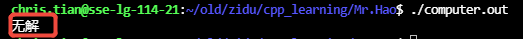


## 7. V++6.0 软件使用详解

略（本次实践实际使用 Linux 环境中 vim + gcc compile 的方式进行）


## 8. C 概述_回顾本讲内容


# 二、C 编程预备计算机专业知识

大纲如二级目录


## 1. CPU\内存条\硬盘\显卡\主板\显示器 之间的关系

硬盘数据-->内存条-->CPU处理-->显卡（声卡）-->显示器（扬声器）

主板提供平台


## 2. HelloWorld 程序如何运行起来的

`helloworld.c`

```c
# include <stdio.h>

int main(void){
    printf("Hello World !\n");
    return 0;
}
```

编译(build) --> 连接(compile) --> 生成二进制文件(win下是.exe) --> 操作系统调用CPU执行二进制文件

P.S. win98 & winMe 可以提供接口直接控制硬件，win2000 及之后不可以。

## 3. 什么是数据类型

数学上

> 整数|实数|有理数|无理数|虚数|字符

计算机上

> 整数|实数|字符

- 基本类型数据

  - 整数

    - 整型 —— `int` （占4个字节）
    - 短整型 —— `short int` （占2个字节）
    - 长整型 —— `long int` （占8个字节）

  - 浮点数【实数】

    - 单精度浮点数 —— `float` （占4个字节）
    - 双精度浮点数 —— `double` （占8个字节）
  
  
    - 字符
  
      - 单个字符 —— `char`   (占1个字节)
  

```c
# include <stdio.h>

int main(void){
        //int i = 10.6; //表示i变量是整型变量，所谓整型变量就是指i只能存放整数，不能存放实数
        //printf("%d\n", i);
        char i = 'A';
        printf("%c\n", i);
        return 0;
}
```


- 复合类型数据


  - 结构体

  - 枚举

  - 共用体

    


## 4. 什么是变量

```c
# include <stdio.h>

int main(void){
        int i;
        i = 3; // 3 最终是被存放在内存中，程序终止之后3所占的空间被释放掉了
        printf("i = %d\n", i);
        return 0;
}
```

**变量的本质就是内存中一段存储空间**


## 5. CPU 内存条 VC++6.0 操作系统 之间的关系

略


## 6. 变量为什么必须初始化

**<span style="color:red">变量为什么必须初始化</span>**

- <span style="color:red">所谓初始化就是赋值的意思</span>

  以下code中`i` 未初始化

```c
# include <stdio.h>

int main(void){
        int i;
        printf("i = %d\n", i);
        return i;
}
```
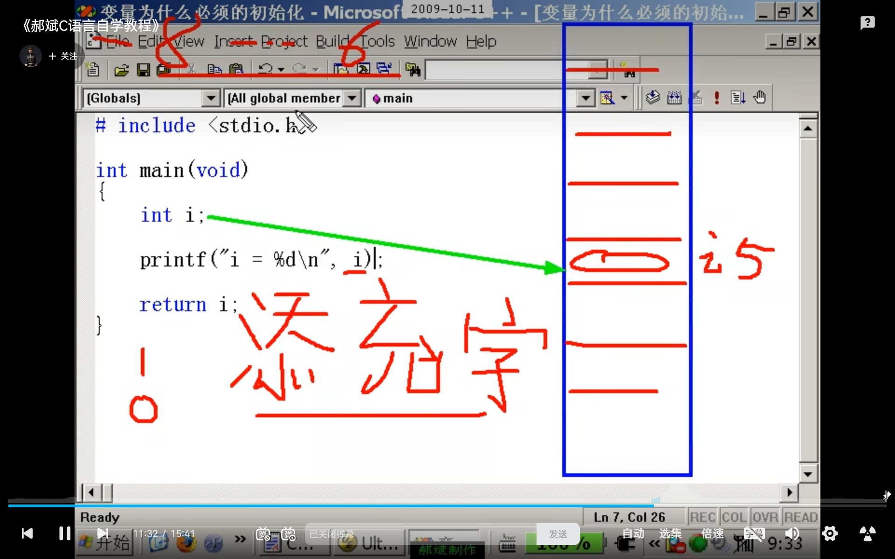

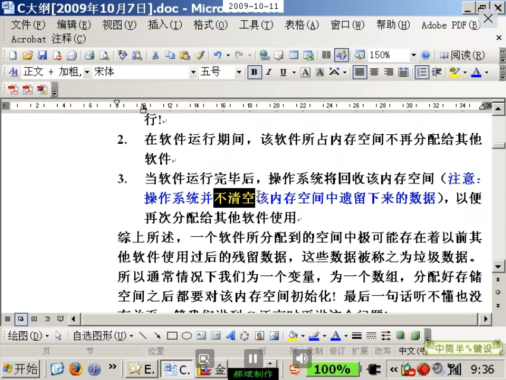

P.S. VC++ 有填充字

### 遇到的问题

如此运行后，为什么我本地gcc编译后得到结果“i = 0”，但是在线编译后执行结果“i = 32767”

>chatgpt 答案 <begin>

你遇到的现象是 **未初始化变量的行为不确定**，这正是 C 语言中的**未定义行为（UB, Undefined Behavior）**。

#### **为什么本地 GCC 输出 `i = 0`？**

在本地运行时，`i` 可能刚好分配到了**栈上一个被清零的区域**，因此 `i` 被读取时的值是 `0`。但是这只是**偶然**的，并不意味着 `i` 真的初始化为 `0`。某些情况下，你可能会发现值变化了，比如在优化级别不同或者代码稍作改动时。

#### **为什么在线编译器输出 `i = 32767`？**

在线编译器运行环境和本地环境不同，它的**栈空间布局可能不同**。

- `i` 可能分配到了一个先前存放 `32767` 的内存位置，因此程序**读取了这个随机的旧值**。
- 这说明 `i` 变量所在的内存区域可能存储过 `32767`，但这个值**并不是可靠的**。

#### **未定义行为导致的差异**

- C 语言标准**不保证**未初始化变量的值，它可能是**任何值**。
- 这也解释了为什么你本地运行是 `0`，但在线编译器运行是 `32767`，甚至不同的运行可能产生不同的值。
- `i` 的值**取决于它在栈上分配的位置**以及该位置之前存储的内容。

#### **如何避免这种问题？**

你应该**显式初始化变量**，确保它有确定的值：

```c
#include <stdio.h>

int main(void){
    int i = 0;  // 初始化 i
    printf("i = %d\n", i);
    return i;
}
```

这样，无论在什么环境下编译运行，`i` 的值都会**始终一致**。

#### **编译器如何帮助检测这个问题？**

使用 `-Wall -Wextra -Wuninitialized` 编译选项可以让 GCC 检测这种问题：

```sh
gcc -Wall -Wextra -Wuninitialized -o test test.c
```

如果 `i` 未初始化，一些编译器可能会给出类似警告：

```
warning: ‘i’ is used uninitialized in this function [-Wuninitialized]
```

#### **总结**

- C 语言**不会自动初始化局部变量**，使用未初始化变量会导致**未定义行为**（UB）。
- 不同的编译器、不同的环境、不同的优化级别，都会影响 `i` 的值，导致不同的输出。
- **正确的做法是始终初始化变量**，保证其行为是可预测的。
>chatgpt 答案 <end>

---

## 7. 如何定义变量

    数据类型 变量名 = 要赋的值；

等价于

    数据类型 变量名；
    
    变量名 = 要赋的值

举例子：

```c
int i =3；
# 等价于
int i;
i = 3;

int i,j;
# 等价于
int i;
int j;

int i, j=3;
# 等价于
int i;
int j;
j = 3;

int i = 3, j =5;
# 等价于
int i;
int j;
i = 3;
j =5;

int i,j;
i = j = 5;
# 等价于
int i,j;
i = 5;
j = 5;
```


## 8. 什么是进制

十进制就是逢士进一

二进制就是逢二进一

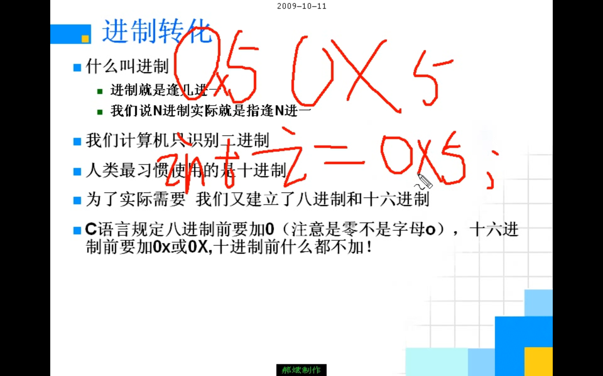


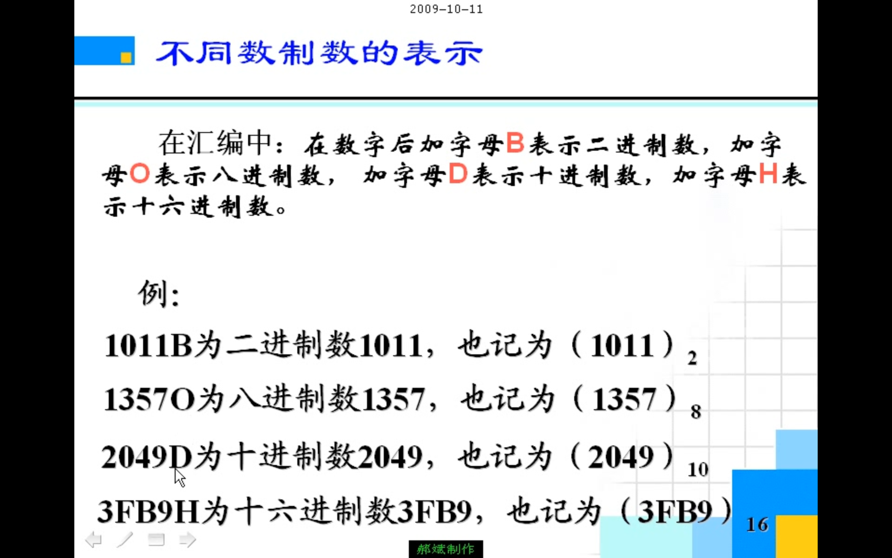


## 9. 常量在C语言中是如何表示的


## 10. 常量是以什么样的二进制代码存储进计算机中的