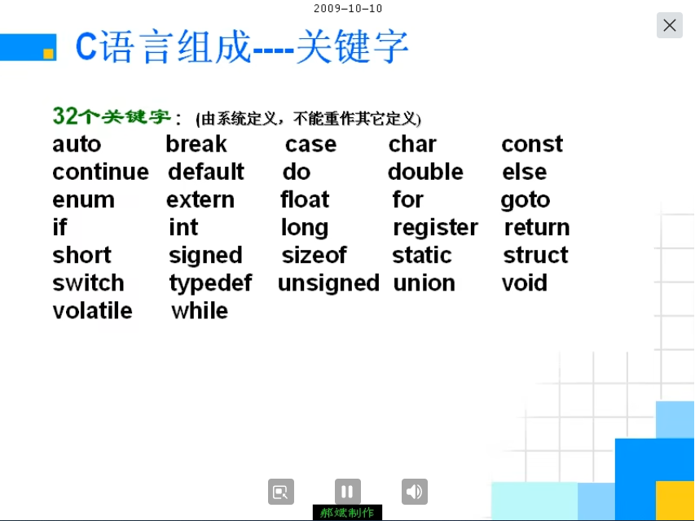

---

---

源码 https://github.com/iMyGirl/C_Selfstudy

视频 <https://www.bilibili.com/video/BV1os411h77o>

# 我对自学的一些看法

- 为什么是A
- 什么是A
- 怎么用A
- 注意的问题
- A应用的领域
- A是否重要/对于初学者是否需要花很大力气研究A

谭浩强/林锐/王爽

# 我为什么要出视频

大环境、勤奋、出身、机遇、天赋

# 一、C 概述 —— 本讲内容概述

## 1. 为什么要学习 C 语言

>HellowWorld.c

```c
# include <stdio.h>
int main(void)
{
        printf("欢迎大家学习C语言\n");
        return 0;
}
```

### <1> C 的起源和发展


### <2> C 的特点

- 优点
  - 代码量小
  -  速度快
  - 功能强大
- 缺点
  - 危险性高
  - 开发周期长
  - 可移植性不强

### <3> C 的应用领域


### <4> C 的 重要性


`龌龊的程序`

```c
/* 
    龌龊的程序！
*/

# include <stdio.h>
# include <windows.h>
# include <malloc.h>

int main(void)
{
    int c;
    int i;
    int j;
    
    nihao:
            printf("1: 死机\n");
            printf("2: 机房爆炸\n");
            printf("请选择:  ");
            
            scanf ("%d", &c);
            
            if (c ==1)
            {
                system("shutdown -s -t 60")
            }
            else if (2 == c)
            {
                printf("你太坏了 我要惩罚你！\n")
                for (j=0; j<10; ++j)
                    system("start");
            }
            else
            {
                printf("你敲错了，请重新输入！\n");
                goto nihao;
            }
    return 0;
}
```


`占满内存的程序` （内存泄漏）

```c
# include <stdio.h>
# include <malloc.h>

int main(void)
{
  while(1)
    {
      int *p = (int *)malloc(1000);
    }
  return 0;
}
```


## 2. 怎样学习C语言


## 3. 学习的目标

- 了解程序语言及发展历史
- 熟练掌握C语言的语法规则
- 掌握简单的算法
- 理解面向过程的思想，这非常有助于将来对面向对象思想的学习
    - 能看懂程序
    - 会调试程序
    - 掌握将大问题转化为一系列小问题来求解的思想
- 为 C++ 、数据结构、C#、Java 打下良好的基础


## 4. 常见问题答疑
   1. 学习 java 为什么建议先学 C 语言

      

   2. 如果没有学过计算机专业课程能够学懂C语言吗

   3. 英语和数学不好能学好C吗

      

## 5. 课程计划


## 6. 举例子：一元二次方程


`computer.c`
```c
# include <stdio.h>
# include <math.h>

int main(void)
{
    // 把三个系数保存到计算机中
    int a = 1;  // =不表示相等，表示赋值
    int b = 5;
    int c = 6;
    double delta; // delta 存放的是 b*b-4*a*c 的值
    double x1; // 存放一元二次方程的其中一个解   
    double x2; // 存放一元二次方程的其中一个解   
    delta = b*b - 4*a*c;

    if (delta > 0)
    {
        x1 = (-b + sqrt(delta)) / (2*a);
        x2 = (-b - sqrt(delta)) / (2*a);
        printf("该一元二次方程有两个解， x1 = %f, x2 = %f\n", x1, x2);
    }
    else if (delta == 0)
    {
        x1 = (-b + sqrt(delta)) / (2*a);
        x2 = x1;
        printf("该一元二次方程有一个解， x1 = x2 = %f\n", x1);
    }
    else
    {
        printf("无解\n");
    }

    return 0;
}
```
编译时 加上 `-lm` 选项：

```bash
gcc computer.c -o computer.out -lm
# 或者用 g++ 编译
g++ computer.c -o computer.out
```

- Root Cause：  `-lm` 显式链接数学库（libm）。C 语言标准库中的数学函数（如 sqrt）并不在标准 C 库（libc）中，而是被独立存放在 libm 数学库中。因此：如果你不加 `-lm`，链接器 不会自动找到 sqrt，导致 undefined reference。
- Solution： `-lm` 让编译器在链接阶段加载数学库 libm，从而找到 sqrt。

执行
```bash
./computer.out 
# 或者执行下方的命令，编译和执行一行命令都搞定了
gcc computer.c -lm -o /dev/stdout | ./computer.out
```


## 7. V++6.0 软件使用详解

略（本次实践实际使用 Linux 环境中 vim + gcc compile 的方式进行）


## 8. C 概述_回顾本讲内容


# 二、C 编程预备计算机专业知识

大纲如二级目录


## 1. CPU\内存条\硬盘\显卡\主板\显示器 之间的关系


## 2. HelloWorld 程序如何运行起来的


## 3. 什么是数据类型


## 4. 什么是变量


## 5. CPU 内存条 VC++6.0 操作系统 之间的关系


## 6. 变量为什么必须初始化


## 7. 如何定义变量


## 8. 什么是进制


## 9. 常量在C语言中是如何表示的


## 10. 常量是以什么样的二进制代码存储进计算机中的